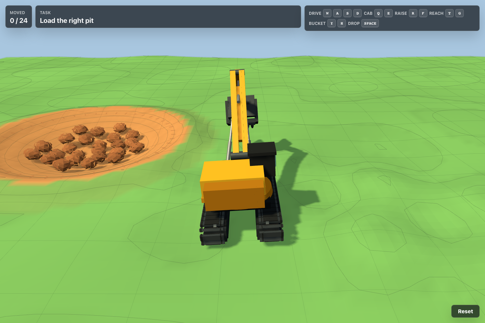

# Excavator MVP

An interactive browser-based excavator game built with Three.js, Rapier physics, and Vite. Drive the tracked excavator, swing the cab, control the boom and bucket, then move all cargo from the source pit into the target pit.

## Live Demo

Hosted on GitHub Pages: [https://bhandras.github.io/excavator/](https://bhandras.github.io/excavator/)

## Screenshot



## Controls

| Action | Keys |
| --- | --- |
| Drive | `W` `A` `S` `D` |
| Rotate cab | `Q` `E` |
| Raise/lower boom | `R` `F` |
| Extend/retract reach | `T` `G` |
| Curl bucket | `Y` `H` |
| Drop cargo | `Space` |

## Local Development

Install dependencies:

```sh
npm install
```

Run the development server:

```sh
npm run dev
```

Build for production:

```sh
npm run build
```

Preview the production build:

```sh
npm run preview
```

The Vite base path is configured for GitHub Pages deployment at `/excavator/`.
